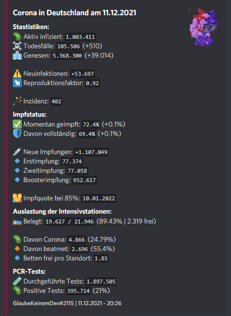
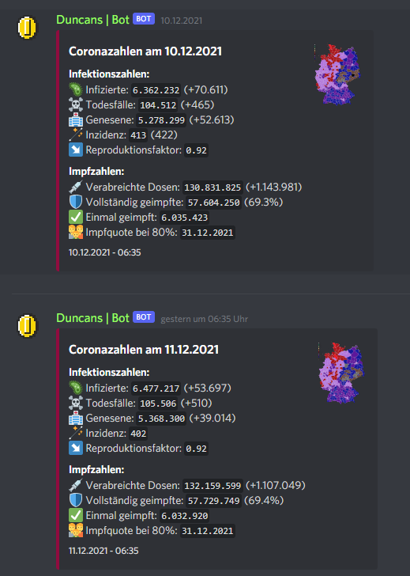
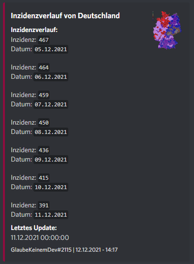

# DiscordCoronaBot
Brings German daily updates and forecasts about Covid-19 to your Discord server. With data from the [rki-covid-api](https://api.corona-zahlen.org) by Marlon Lückert and from the [DIVI](https://www.intensivregister.de/#/index). Created with the [JDA-Utilities](https://github.com/GlaubeKeinemDev/JDA-Utilities) library.

The bot gives data about:
- 🤧 cases (over all and compared to the last day)
- ☠️ deaths (over all and compared to the last day)
- 🟢 recovered (over all and compared to the last day)
- ↘  R value 
- 📈 week incidence (and incidence history)
- 💉 vaccination data (first dose, second dose, booster, current quote)
- 👪 Vaccination Quote forecast
- 🏥 Hospital data (Intensive care beds free per location, used beds, current covid beds and free beds)
- 🧪 PCR-tests (about pcr tests in the current week, posibility rate)
- 🗺️ Map Overview with all districts and colored incidence numbers

❓ How to use:

- Go to https://discord.com/developers/applications and create a application
- Invite the bot to your Discord server
- Download the project on the releases page
- Upload the jar to your server
- Be sure you have installed at least Java 11 on your server
- Now just start the jar
- By starting the first time, folders and files will be created
- Stop the programm
- Go to the config file and add information about your bot (like the bot key)
- Now just start the bot again

💻 Commands:

1. Corona:
  - This command will show you the overview about all data
  - Optional: Add a district/state to the command arguments and the bot will send you information about the state/district

2. Incidence:
  - This command will show you the incidence history
  - Be sure to add a number as argument for the given days

🖼️ Pictures:

1. Corona Command

2. Daily updates

3. Incidence Command

